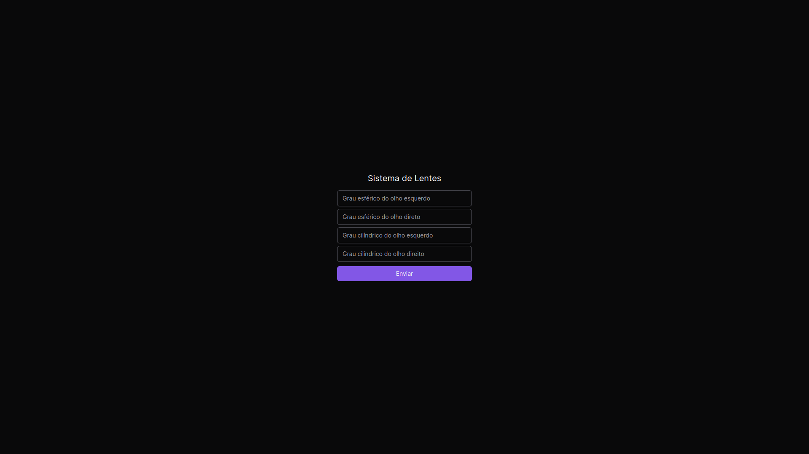

### Link do deploy do sistema na Vercel: [System Lenscope](https://lenscope-system.vercel.app/) 

---

## 🚀 Tecnologias

Esse sistema foi desenvolvido com as seguintes tecnologias:

- TailwindCSS
- ReactJS
- TypeScript

## 💻 Sistema

O sistema faz uma verificação conforme os parâmetros informados pelo usuário e
retorna a lente apropriada para o mesmo.

### Parâmetros

- Grau Esférico do Olho Esquerdo
- Grau Esférico do Olho Direito
- Grau Cilíndrico do Olho Esquerdo
- Grau Cilíndrico do Olho Direito

## :octocat: Instalação

Para clonar o repositório

```sh
git clone https://github.com/Italo-Alves/Lenscope-System.git
```

Para instalar as dependências com NPM 

```sh
npm i
```

Para instalar as dependências com Yarn 

```sh
yarn install
```

Para iniciar o ambiente de desenvolvimento com NPM

```sh
npm run dev
```

Para iniciar o ambiente de desenvolvimento com Yarn

```sh
yarn dev
```

---

Feito com ♥ by Italo Alves :wave: